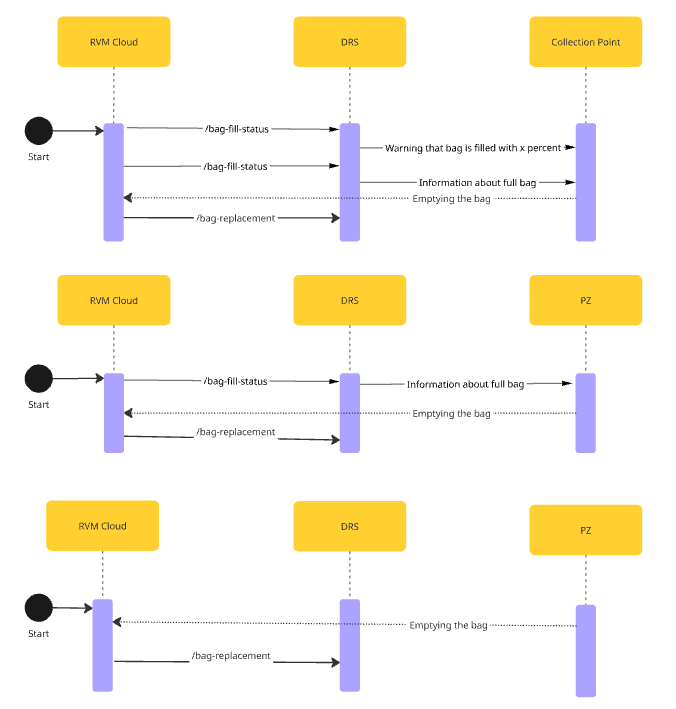

# RVM With Scanner

## Overview

The process for **RVMs equipped with a scanner** allows for the automated scanning of seals and immediate transfer of this information to the **DRS Operator**.

The process can be triggered either by:

- A notification from the RVM indicating that the bag is full
- A manual bag replacement initiated by a **Collection Point** staff member.

## Process Flow


> **Note:** The internall scanner within **RVM** handles the seal scanning and transmits this data automatically during the process.

### Case 1 & 2 – Full Bag Notification Present

These flows apply when the **RVM supports bag fill level detection**:

1. **Start:** The RVM sends `POST /bag-fill-status` to DRS when the bag reaches a defined fill level.
2. **Notification Propagation:** DRS notifies the Collection Point Warning about filled bag.
3. **Full Bag Notification:** The RVM Cloud sends another `POST /bag-fill-status` when the bag is full.
4. **Propagation:** DRS forwards full bag information to the Collection Point or PZ.
5. **Bag Replacement:** After bag replacement, RVM Cloud sends `POST /bag-replacement`.
6. **Seal Handling:** The RVM's internal scanner automatically reads the seal and includes this in the bag replacement event.


### Case 3 – No Bag Fill Status Notification

This case covers scenarios where:

- The **RVM does not support bag fill status**, or
- **Bag replacement occurs before any status notification is triggered**

1. **Start:** Bag is manually replaced.
2. **Bag Replacement:** RVM Cloud sends `POST /bag-replacement` to DRS.
3. **Seal Handling:** The internal scanner scans the seal and includes it in the replacement message automatically.


<!--
type: tab
title: DRS
-->

### POST /bag-fill-status

Informs DRS about the RVM's bag fill level. 

For full overwiev of this endpoint please visit: [POST - /bag-fill-status](../../drs-openapi.yaml/paths/~1bag-fill-status/post)

<details>

<summary>Request Body</summary>

```yaml jsonSchema
  $ref: '../../drs-openapi.yaml#/components/schemas/BagFillStatus'
```

</details>
<br>

<br>

### POST /bag-replacement

Informs DRS that a bag has been replaced.

For full overwiev of this endpoint please visit: [POST - /bag-replacement](../../drs-openapi.yaml/paths/\~1bag-replacement/post)

<details>

<summary>Request Body</summary>

```yaml jsonSchema
  $ref: '../../drs-openapi.yaml#/components/schemas/BagReplacement'
```

</details>
<br>

<!-- type: tab-end -->
