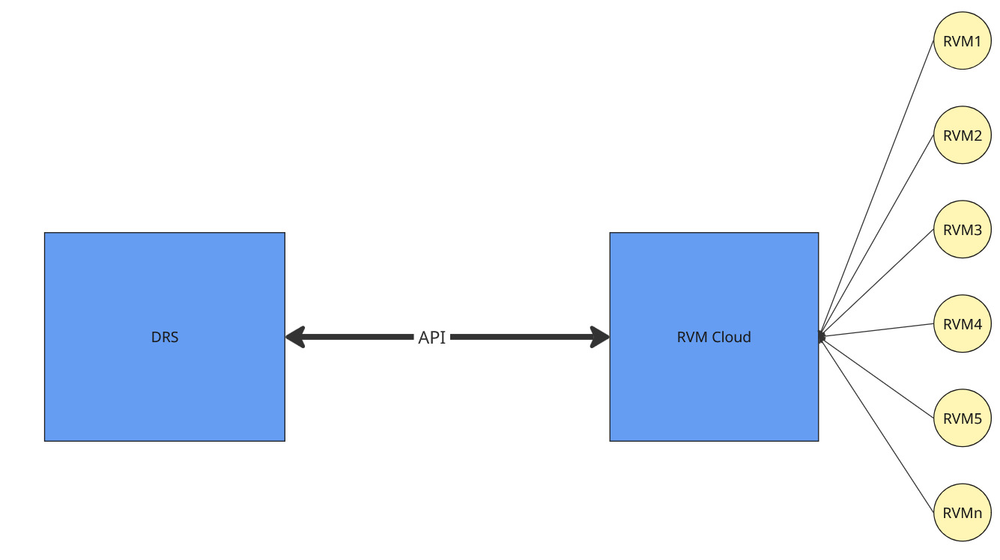

# Overview

This document describes the APIs used by Kaucja.pl to enable communication between Reverse Vending Machines (RVMs) and the Kaucja.pl core DRS system.

The communication model used by Kaucja.pl is illustrated below:

## Integration

This document defines two separate files, each specifying the endpoints that should be exposed on either side of the integration.

  * [DRS](../drs-openapi.yaml) This file defines the API exposed by kaucja.pl. It handles communication and data exchange with external systems.

  * [RVM](../rvm-openapi.yaml) This file specifies the API that RVM providers should expose. This allows DRS to establish a connection and exchange information with RVM systems.

The purpose of this document is to clearly define how both systems should communicate, ensuring compatibility and seamless integration.

---

 Version: 0.9.2

