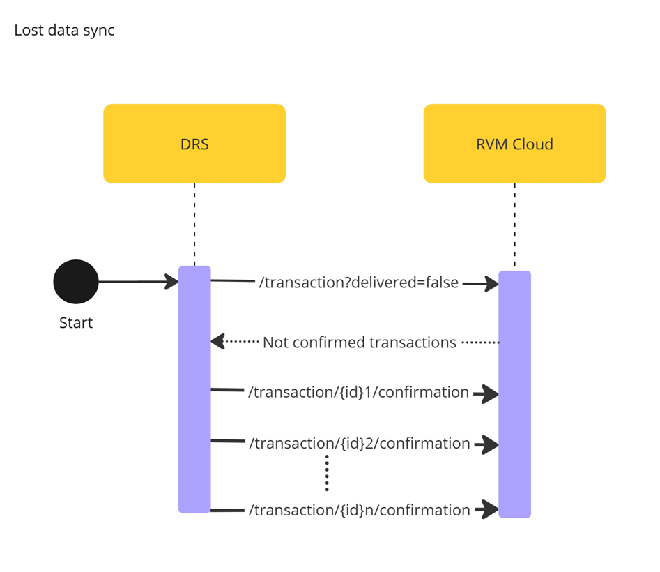
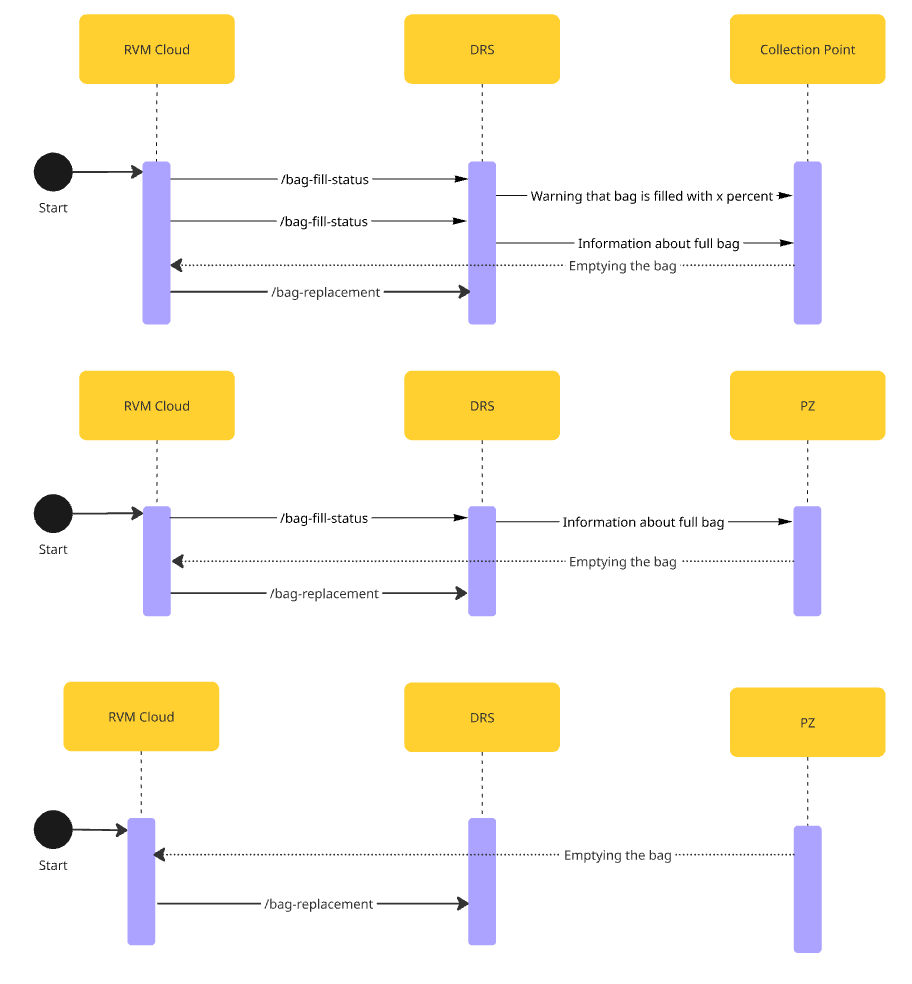

# Document description

This document is describing API expected by Kaucja.pl for contact between RVM and Kaucja.pl core DRS system.

Desired communcation format by Kacuja Pl looks like:

## Integration

This document is showing two separate files, where one of them is showing what endpoints should be exposed on each side.

The one called [DRS](drs-openapi.yaml) is reffering to part that will be exposed from kaucja.pl side.
Second one [RVM](rvm-openapi.yaml) is part that RVM providers should expose in order to DRS be able to communicate with DRS.

# API list

## Data exchange with Deposit Product Catalogue (Katalog Produktów Kaucyjnych)

### New Product added

**DRS**

• [POST - /product](drs-openapi.yaml/paths/~1product/get)

**RVM**

• [POST - /product](rvm-openapi.yaml/paths/~1product/post)

### Deposit Product Catalogue sync

**DRS**

• [GET - /product](drs-openapi.yaml/paths/~1product/get)

## RVM status healthcheck

**RVM**

• [GET - /machine](rvm-openapi.yaml/paths/~1machine/get)

## RVM removal

**RVM**

[DELETE - /machine/{id}/delete](rvm-openapi.yaml/paths/~1machine~1{id}/delete)

## New RVM registration

**RVM**

[POST - /machine](rvm-openapi.yaml/paths/~1machine/post)

## Transaction data exchange

### Transaction data transfer to DRS

**DRS**

[POST /transaction](drs-openapi.yaml/paths/~1product/post)

### Lost data sync

**RVM**

[**GET - /transaction**](rvm-openapi.yaml/paths/~1transaction/get)

[**PUT - /transaction/{}/confirmation**](rvm-openapi.yaml/paths/~1transaction~1{id}~1confirmation/put)

## Bag replacement

### RVM with scanner

The input to the process can be both information from the RVM that the bag is full and an exchange resulting from the initiative of a Collection Point employee.

For an RVM that has an external scanner, the process of scanning the seal and transmitting information about it to the DRS Operator is done using it.

**DRS**

[POST - bag-is-full](drs-openapi.yaml/paths/~1bag-is-full/post)

[POST - bag-replacement](drs-openapi.yaml/paths/~1bag-replacement/post)

### RVM without scanner

For RVMs that do not have an external scanner, the process of scanning the seal is done via a mobile application provided by the DRS Operator, or an equivalent device.

It is important to understand that in order to keep track of all bags only after receiving confirmation of sealing from mobile app RVM should be unblocked.

**DRS**

[POST - bag-is-full](drs-openapi.yaml/paths/~1bag-is-full/post)

[POST - bag-replacement](drs-openapi.yaml/paths/~1bag-replacement/post)

[POST - bag-seal (between PZ - DRS)](drs-openapi.yaml/paths/~1bag-seal/post)

**RVM**

[PUT - /machine/{id}/unblock](rvm-openapi.yaml/paths/~1machine~1{id}~1unblock/put)