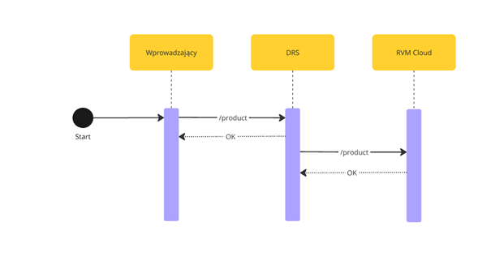

# Adding product by introducer


## Description
# Product Addition Process  

The process of adding a new product to the manufacturer's product catalog follows these steps:  

1. The process begins with the submission of a new product by the **Introducer**.  
2. The **Introducer** submits a `POST /product` request to the **Deposit Return System (DRS)**.  
3. The **DRS** immediately responds with an `OK` confirmation to the **Introducer**, indicating that the product has been recorded in its database.  
4. Optionally, the **DRS** may forward a `POST /product` request to the **Reverse Vending Machine (RVM) Cloud**, enabling product recognition in RVMs. 

This process ensures that new products are registered in the **DRS** and can be made recognizable by **Reverse Vending Machines (RVMs)** if the optional step is executed.  

> **Note:** Upon failure described in step number 4, no retries will be made towards **RVM Cloud**. No error will be propagated to **Introducer** side either.  

> **Sync Requirement:** Regardless of this process, all **RVM Providers** are required to perform a **full product data synchronization every 24 hours** to ensure their product database remains up to date.  

## API Endpoints  

<!--
type: tab
title: DRS
-->
Call made by Introducer towards DRS
[DRS API - POST /product](https://kaucja.stoplight.io/docs/rvm-api/drs-openapi.yaml/paths/~1product/post)  

```yaml json_schema
  $ref: '../../drs-openapi.yaml#/components/schemas/ProductPost'
```

<!--
type: tab
title: RVM
-->
- [RVM API - POST /product](https://kaucja.stoplight.io/docs/rvm-api/rvm-openapi.yaml/paths/~1product/post)  

<!-- type: tab-end -->