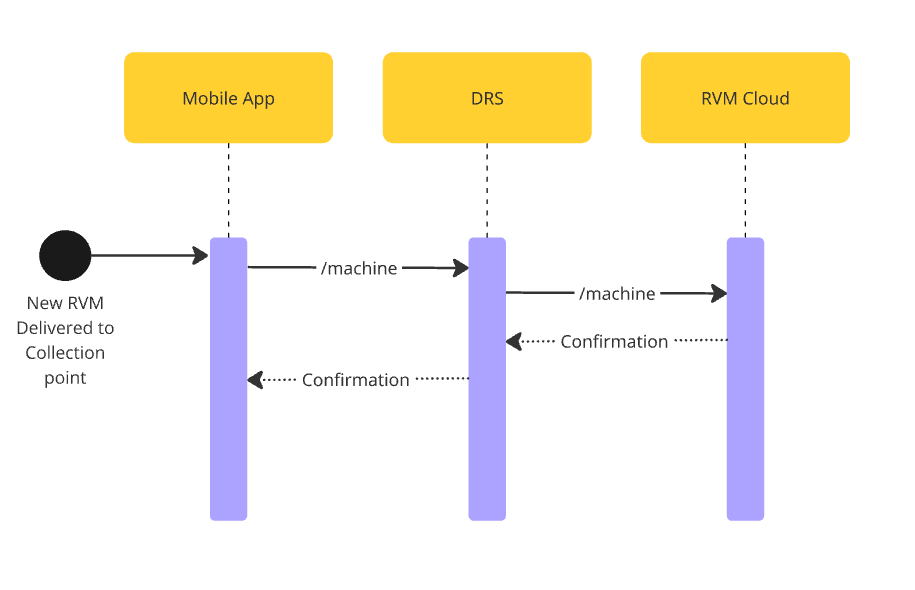

# Add/Update Machine 

## Overview

The **Add or update Machine** process is a performed by **DRS** through their mobile application. It ensures that a new machine is properly registered in **RVM Cloud**.


## Process Flow

1. **Start:** The registration process begins in the **mobile app** when Collection Point wants to register new RVM.
2. **API Endpoint:** The request is made to the `/machine` endpoint in **DRS**.
3. **DRS**: Processing request and select appropriate RVM Vendor based on selected machine
4. **API Endpoint:** The request is made to the `/machine` endpoint in **RVM Cloud**.
5. **RVM Cloud**: Process request.
6. **Response:** RVM Cloud processes the request and sends back a **confirmation** with ID created in system.
7. **Response**: **DRS** Notifies Collection point that machine has been sucesfully registered

<!--
type: tab
title: DRS
-->

Representation of API Endpoinds exposed by **DRS** in order to complete this prcess.

### POST /product

For full overwiev of this endpoint please visit: [POST - /machine](https://kaucja.stoplight.io/docs/rvm-api/ltd4iqkgs22yd-add-new-rvm-to-collection-point)

<details>
<summary>Request Body</summary>

```yaml jsonSchema
  $ref: '../../drs-openapi.yaml#/components/schemas/RegisterMachine'
```
</details>

<!--
type: tab
title: RVM
-->

Representation of API Endpoinds exposed by **RVM Cloud** in order to complete this prcess.

### POST /product

For full overwiev of this endpoint please visit: [POST - /machine](https://kaucja.stoplight.io/docs/rvm-api/35nqny8k7q39d-add-new-rvm)

<details>
<summary>Request Body</summary>

```yaml jsonSchema
  $ref: '../../models/PostMachine.yaml'
```

</details>

<!-- type: tab-end -->

---
<div style="text-align: right"> Version: 0.9.2</div>
