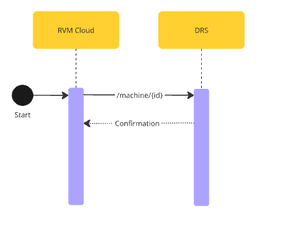

# Remove Machine in DRS by RVM Operator



# RVM Removal

## Overview
This process enables **RVM providers** to formally remove or decommission an **RVM** from the **DRS** system when it is no longer in service or has been relocated outside of the supported infrastructure.

## Process Flow
1. **Start:** The removal process is initiated from the **RVM Cloud**.
2. **API Endpoint:** A removal request is sent to **DRS** using the following endpoint `DELETE /machine/{id}`
3. **Response:** After processing, **DRS** confirms the removal of the machine from its registry.

> **Note:** Once removed, the RVM will no longer be tracked or monitored by the DRS system. All related data integrations are terminated.

---

## Valid Reasons for Removal

RVM providers may request removal of a machine in the following cases:

- **Decommissioning**: The machine is being retired permanently.
- **Relocation**: The machine is moving to a location outside the scope of the DRS system.
- **Customer Non-Payment**: The customer is not paying for the machine or related services.
- **Operational Issues**: The machine has been deemed inoperable or unsafe.

---

<!--
type: tab
title: DRS
-->

### DELETE /machine/{id}

Used by **RVM Cloud** to request the removal of a machine from the DRS registry.

For a full overview of this endpoint, please visit: [DELETE - /machine/{id}](../../drs-openapi.yaml/paths/~1machine~1{id}/delete)

<details>
<summary>Path Parameter</summary>

```yaml
id:
  type: string
  description: Unique identifier of the machine to be removed.
```
</detals>


<!-- type: tab-end -->