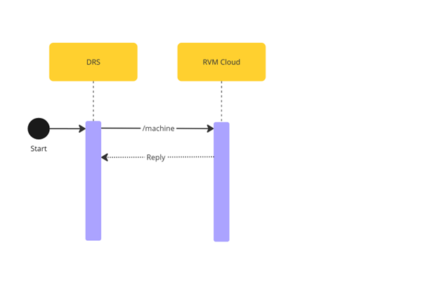

# Machine Information Retrieval

## Overview

The **Machine Information Retrieval** process allows **DRS** to obtain details about registered RVM machines from **RVM Cloud**. This can be done in two ways:

1. **Single Machine Data:** Retrieve information about a specific machine using its unique ID.
2. **All Machines Data:** Retrieve a paginated list of all registered RVM machines.

## Process Flow

1. **Start:** The information retrieval process is initiated from the **DRS system**.
2. **API Endpoint:** The request is made to one of the two endpoints in **RVM Cloud**:
   - `GET /machine/{id}` for single machine details.
   - `GET /machine` for a paginated list of all machines.
3. **Response:** RVM Cloud processes the request and returns the requested machine data.

## RVM Exposed Endpoints
Representation of API endpoints exposed by **RVM Cloud** to complete this process.

### GET /machine/{id}

Retrieves detailed information about a specific machine using its unique identifier.

For a full overview of this endpoint, please visit: [GET - /machine/{id}](../../rvm-openapi.yaml/paths/\~1machine\~1{id}/get)

<details>
<summary>Path Parameter</summary>

```yaml
id:
  type: string
  description: Unique identifier of the machine.
```

</details>

<details>
<summary>Response Body</summary>

```yaml jsonSchema
  $ref: '../../rvm-openapi.yaml#/components/schemas/Machine'
```

</details>

<br>

### GET /machine

Retrieves detailed information about all machines.

For a full overview of this endpoint, please visit: [GET - /machine](../../rvm-openapi.yaml/paths/\~1machine/get)

<details>
<summary>Response Body</summary>

```yaml jsonSchema
  $ref: '../../rvm-openapi.yaml#/components/schemas/MachinePaginated'
```

</details>

