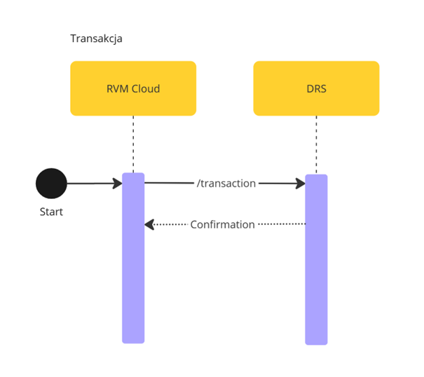

# Transaction Process

## Overview

The **Transaction Process** handles interactions between **RVM Cloud** and **DRS**, ensuring that transaction data is transmitted and confirmed correctly.

## Process Flow

1. **Start:** The transaction process begins in **RVM Cloud**.
2. **API Endpoint:** The transaction data is sent to the one of endpoints in **DRS**:
   - `POST /transaction` for single transaction details.
   - `POST /transaction/bulk` for multiple transaction details - it does accept an array of transactions posted.
3. **Response:** DRS processes the transaction and returns a **confirmation** response to **RVM Cloud**.
   - Response contains information about voucher that should be paid to customer e.g it's value, currency and whether it should be pait at all.
4. After **DRS** return confirmation **RVM Cloud** set transaction as processed in its system.

<!-- theme: none --> 
> **Information**: Payment should be determined as follows:
>
>   - If the DRS is operational, issue the coupon based on its response.
>   - If the DRS is down or unreachable, issue the coupon based on Product Catalogue Data prices.
>   - If the RVM machine is in offline mode, issue the coupon based on Product Catalogue Data prices.


> **Note:** In case of unuccesful attempt, **RVM Cloud** is expected to retry the call several times. Also there will be mechanism on **DRS** side to fetch all unprocessed transaction once per day - Process is described in [DRS Transaction Retry Mechanism](Retry-Transaction-Fetch.md).

> **Note**: In case of duplicate ID, HTTP Code 409 will be returned.


<!--
type: tab
title: DRS
-->

Representation of API endpoints exposed by **DRSo** to complete this process.

### POST /transaction

For a full overview of this endpoint, please visit: [POST - /transaction](../../drs-openapi.yaml/paths/\~1transaction/post)

<details>
<summary>Request Body</summary>

```yaml jsonSchema
  $ref: '../../models/Transaction.yaml'
```

</details>

<details>
<summary>Response</summary>

```yaml jsonSchema
  $ref: '../../drs-openapi.yaml#/components/schemas/TransactionConfirmation'
```

</details>
<br> <br>


### POST /transaction/bulk

For a full overview of this endpoint, please visit: [POST - /transaction](../../drs-openapi.yaml/paths/~1transaction~1bulk/post)

<details>
<summary>Request Body</summary>

```yaml jsonSchema
  $ref: '../../drs-openapi.yaml#/components/schemas/BulkTransaction'
```

</details>
<details>
<summary>Response</summary>

```yaml jsonSchema
  $ref: '../../drs-openapi.yaml#/components/schemas/BulkTransactionConfirmation'
```

</details>

<!-- type: tab-end -->

---
<div style="text-align: right"> Version: 0.9</div>

